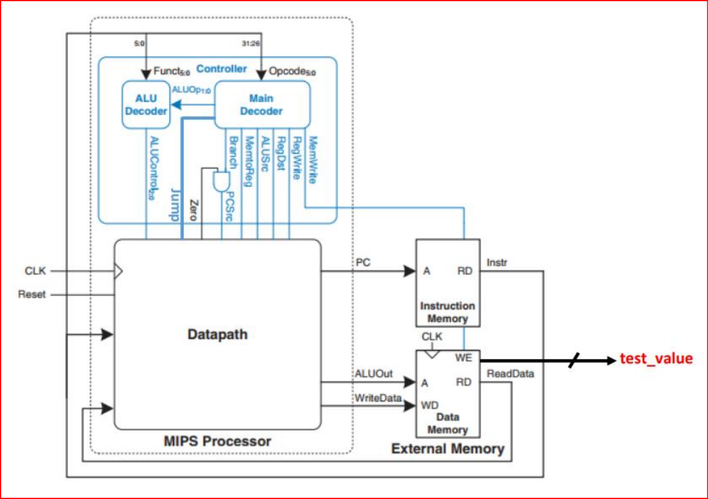

# Single_Cycle_MIPS_32_bit
MIPS stands for "Microprocessor without Interlocked Pipeline Stages," and it is a kind of "RISC Reduced Instruction Set Computer”. It was developed in the 1980s by John Hennessy and his colleagues at Stanford University and after that, it was used in many important applications like gaming consoles, digital TVs, and high-performance computers.
<pre>
  
MIPS has three methods for implementation:

  1-Single-cycle: each instruction is executed in a single cycle.

  2-multi-cycle: each instruction is broken into a series of steps and instructions are executed one after another. 

  3-Pipelined: each instruction is broken into a series of steps and multiple instructions are executed in parallel.

</pre>
  ##

<pre>
  
What makes MIPS special is the simplicity of its instruction set. Instructions are divided to 3 types:
  1-R-type instruction.
      -add
      -sub
      -and
      -or
      -slt
  2-I-type instruction.
      -beq
      -addi
  3-J-type instruction.
      -j
      -jal
</pre>

MIPS contains 32 registers in its register file :

In our project we are focusing on single-cycle MIPS
<pre>
single-cycle MIPS consists of 2 units :
  
    - Control unit: which takes the instruction machine code [opcode, function] and generates the control signals needed for executing it.
    - datapath: which performs according to the control signals to generate the right results.

There are external 2 units attached to MIPS:
    - instruction memory: used to store the program to be executed
    - data memory: used as external larger store unit for the microprossesor
</pre>

