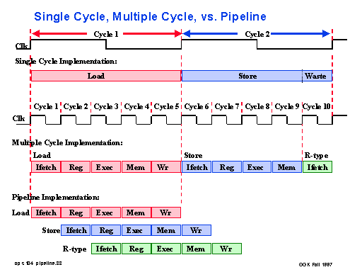
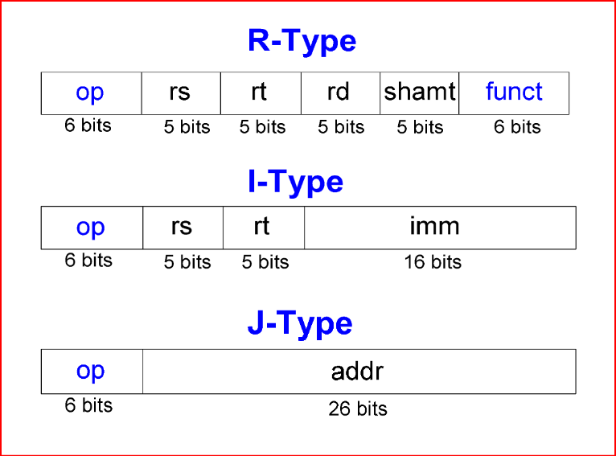
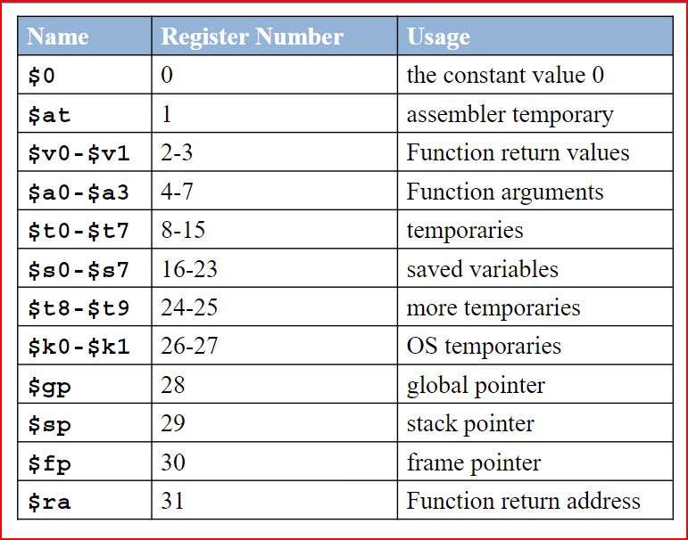

# Single_Cycle_MIPS_32_bit
MIPS stands for "Microprocessor without Interlocked Pipeline Stages," and it is kind of "RISC Reduced Instruction Set Computer".It was developed in the 1980's by John Hennessy and his colleagues at Stanford University and after that it was used in many important applications like gaming consoles, digital TVs and high-performance computers. 
<pre>
  
MIPS has three methods for implementation: 
  1-Single-cycle : each instruction is executed in a single cycle. 
  2-Multi-cycle : each instruction is broken into series of steps and instructions is executed one after another.  
  3-Pipelined : each instruction is broken into series of steps and multiple instructions are being excuted in parallel. 

</pre>
  ##

<pre>
  
What makes MIPS special is the simplicity of its instruction set. Instructions are divided to 3 types:
  1-R-type instruction.
    -add
    -sub
    -and
    -or
    -slt
  2-I-type instruction.
    -beq
    -addi
  3-J-type instruction.
    -j
    -jal
</pre>

MIPS contains 32 registers in its register file :

